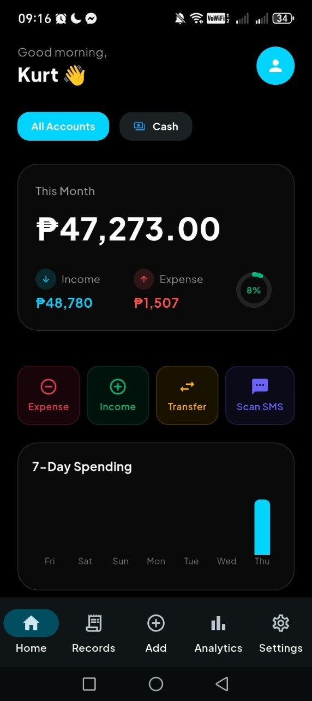
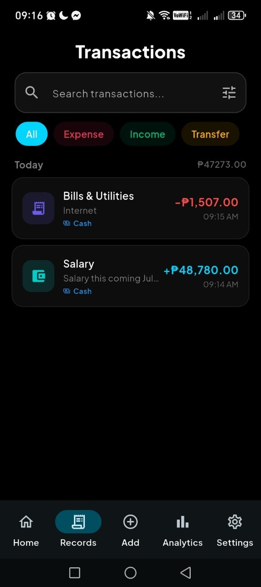
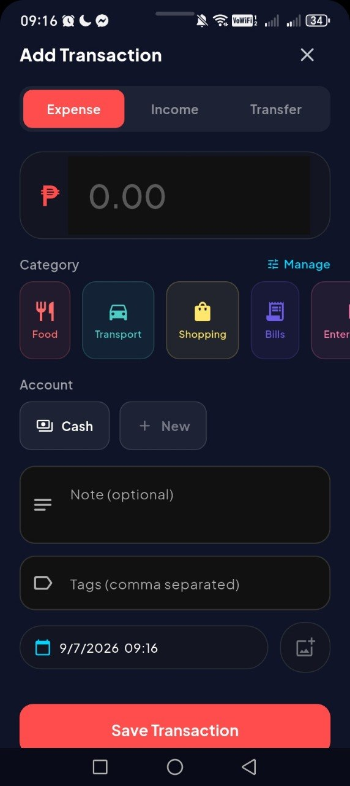
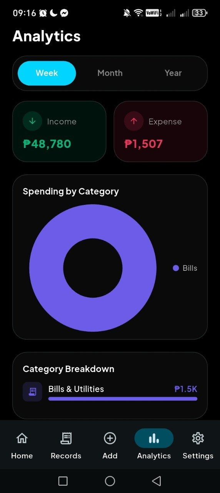
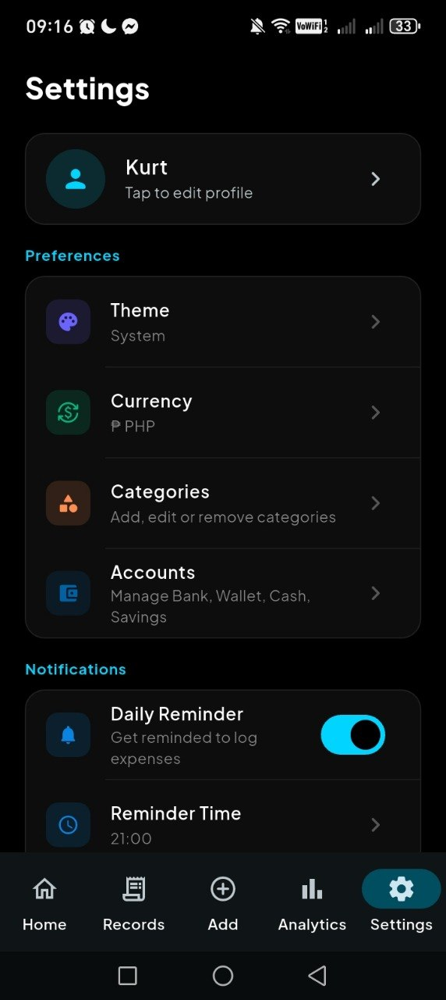

<div align="center">


# tekflow

**Track every peso, own your future.**

A production-grade, 100% offline personal finance tracker built with Flutter.
Beautiful glassmorphism UI · Riverpod state · Hive local database · Zero data collection.

[](LICENSE)
[](https://flutter.dev)
[](https://dart.dev)
[](https://github.com/kaikoden/tekflow/actions)
[](CONTRIBUTING.md)

[**Download APK**](../../releases/latest) · [**Landing Page**](https://kaikoden.github.io/tekflow) · [**Report Bug**](../../issues/new?template=bug_report.md) · [**Request Feature**](../../issues/new?template=feature_request.md)

</div>

---

## Features

| | Feature | Description |
|---|---|---|
| 💰 | **Transaction Tracking** | Log income, expenses, and transfers with categories, notes, and tags |
| 📊 | **Analytics** | Bar charts, pie charts, weekly/monthly/yearly breakdowns |
| 🎯 | **Budget Tracking** | Set monthly budgets per category with live progress bars |
| 📱 | **SMS Bank Reader** | Auto-reads bank transaction SMS — 100% local, never uploaded |
| 🔐 | **App Lock** | Biometric / device PIN gate on open and on background resume |
| ☁️ | **Backup & Restore** | Export full data as JSON and restore from file |
| 🌙 | **Dark / Light Mode** | Instant theme switching, follows system preference |
| 💱 | **Multi-Currency** | PHP (default), INR, USD, EUR, GBP, JPY, AUD, CAD, SGD, AED |
| ✨ | **Glassmorphism UI** | Frosted glass cards with spring animations throughout |
| 🚫 | **100% Offline** | Zero network calls, zero telemetry, zero cloud |

---

## Screenshots

<div align="center">
  
  
  
  
  
  
</div>

---

## Tech Stack

| Layer | Technology |
|---|---|
| Framework | Flutter 3.x, Dart 3.x |
| State Management | `flutter_riverpod` (StateNotifierProvider) |
| Local Database | `hive` + `hive_flutter` (hand-written adapters, no build_runner) |
| Charts | `fl_chart` v0.68 |
| Animations | `flutter_animate`, `animations` |
| Typography | Google Fonts — Plus Jakarta Sans |
| Biometric Auth | `local_auth` |
| SMS Reading | `flutter_sms_inbox` |
| Notifications | `flutter_local_notifications`, `flutter_timezone` |
| Background Tasks | `workmanager` |
| File Operations | `path_provider`, `share_plus`, `file_picker` |

---

## Getting Started

### Prerequisites

- [Flutter SDK](https://docs.flutter.dev/get-started/install) ≥ 3.0.0
- Android SDK (for Android builds)
- A physical or virtual Android device

### Clone & Run

```bash
# 1. Clone
git clone https://github.com/kaikoden/tekflow.git
cd tekflow

# 2. Install dependencies
flutter pub get

# 3. Run on connected device
flutter run
